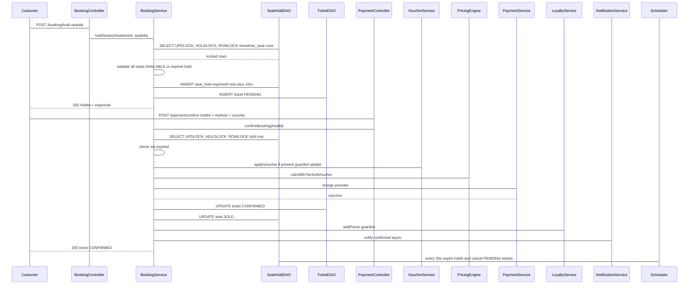
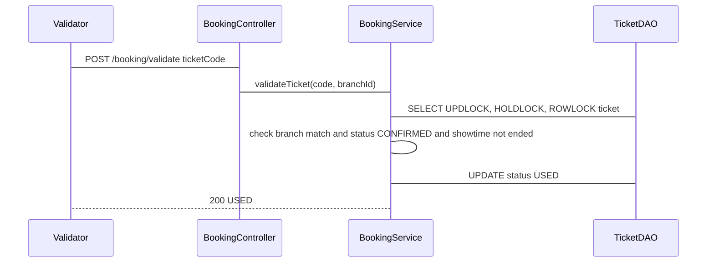
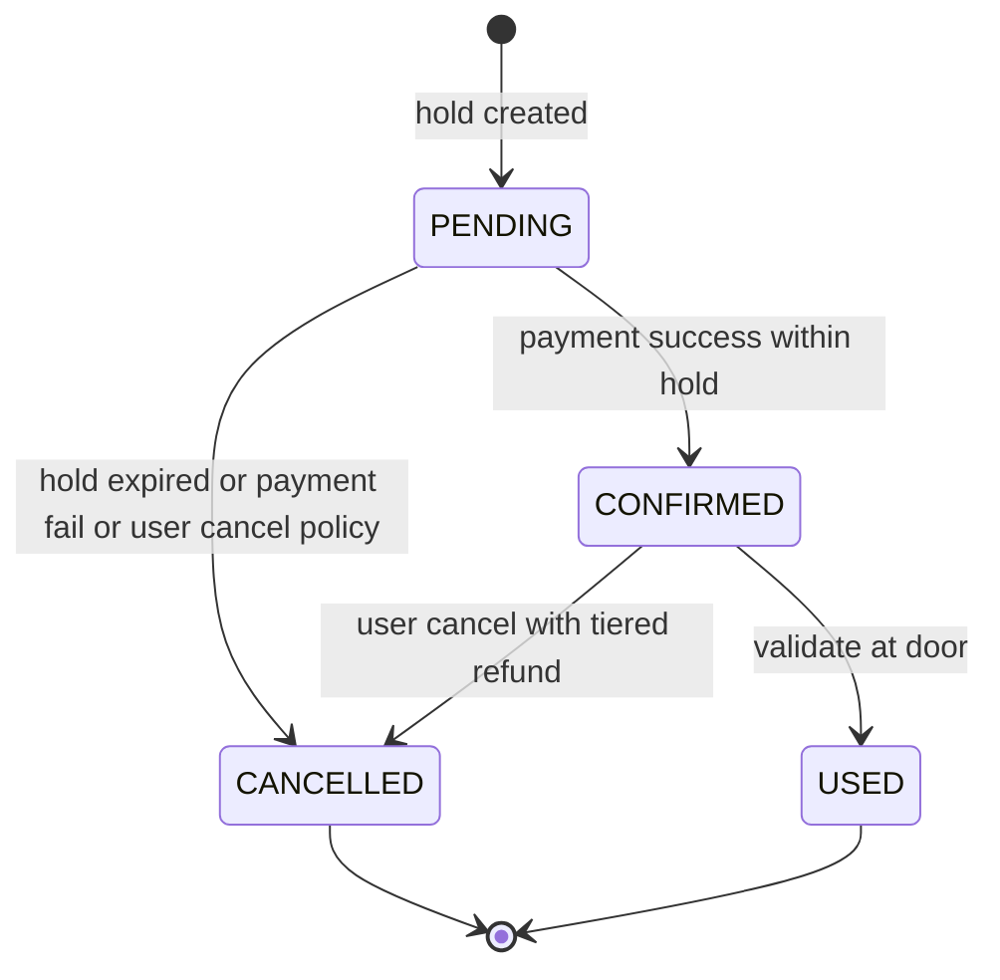
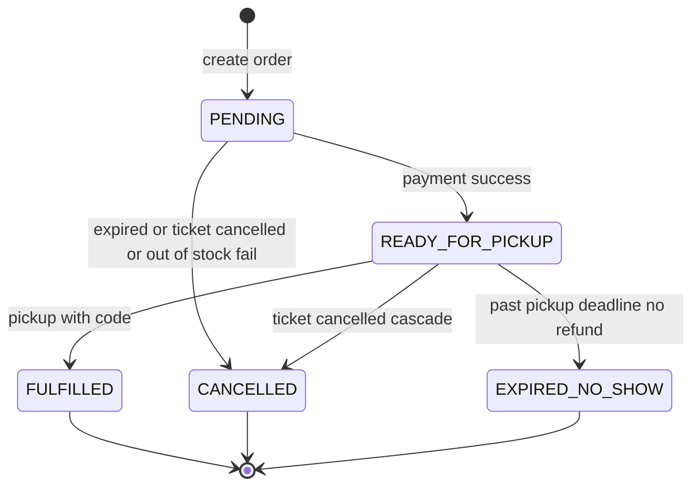

# Thiết kế kỹ thuật — multi-branch-cinema (Hệ thống quản lý rạp chiếu phim đa chi nhánh, JSP/Servlet)

## Overview

**Mục đích**: Xây dựng hệ thống quản lý chuỗi rạp chiếu phim đa chi nhánh thống nhất, bao phủ toàn bộ vòng đời nghiệp vụ từ quản trị tập trung (phim, chi nhánh, khung giá, voucher, sản phẩm bắp nước), vận hành chi nhánh (phòng chiếu, sơ đồ ghế, lịch chiếu, bán vé/bắp nước tại quầy), trải nghiệm khách hàng online (tìm suất chiếu, giữ ghế 10 phút, đặt vé/bắp nước, thanh toán mock/ví/chuyển khoản, tích điểm — hạng thành viên) đến soát vé và đối soát ca — với kiểm tra đầu vào, quy tắc nghiệp vụ, chuyển trạng thái và phạm vi chi nhánh được kiểm soát đầy đủ, đồng thời ngăn double-booking dưới tải đồng thời.

**Người dùng**: 5 vai trò theo đặc tả: Admin (quản trị toàn chuỗi), Branch Manager (quản lý chi nhánh), Branch Staff (nhân viên quầy/soát vé/F&B), Customer (khách hàng có tài khoản), Guest (khách vãng lai duyệt phim/suất chiếu).

**Tác động**: Thay thế quy trình thủ công/rời rạc bằng một ứng dụng web JSP/Servlet tập trung, nguồn dữ liệu duy nhất cho phim/giá/voucher/sản phẩm, cô lập dữ liệu theo chi nhánh, và luồng đặt vé có kiểm soát đồng thời.

### Goals
- Bao phủ 23 nhóm yêu cầu (Req 1–23) với kiểm tra đồng thời: khóa bi quan cho ghế, khóa lạc quan/guard cho tồn kho/ví/voucher.
- Cô lập dữ liệu theo chi nhánh trên mọi truy vấn/ghi; Admin nhìn toàn chuỗi.
- Giữ ghế 10 phút với giải phóng kép: lazy expiry khi đọc + scheduler 30s.
- Thanh toán đa phương thức (tiền mặt/cổng mock/chuyển khoản/ví) với idempotency.
- F&B toàn trình: Admin quản danh mục/combo, chi nhánh quản tồn kho, bán offline và đặt online gắn suất chiếu.
- Tích điểm/hạng thành viên và hoàn tiền bậc thang 24h/2h/used.

### Non-Goals
- Tích hợp cổng thanh toán thật, hóa đơn điện tử/kế toán thuế, chuỗi cung ứng nhập hàng từ nhà cung cấp ngoài — chỉ kiểm kê tồn kho nội bộ chi nhánh.
- Ứng dụng mobile native, tích hợp phân phối phim bên thứ ba.
- Hạ tầng triển khai/production ops (chỉ cung cấp cấu hình Tomcat/JNDI và script DB).

---

## Boundary Commitments

### This Spec Owns
- Toàn bộ miền nghiệp vụ 23 requirements và dữ liệu do chúng sinh ra: chi nhánh, phim, phòng/sơ đồ ghế, lịch chiếu, khung giá, suất chiếu discovery, vé/giữ ghế, thanh toán (4 provider), voucher/promo, tích điểm/hạng, ví khách hàng, sản phẩm/combo bắp nước, tồn kho chi nhánh, đơn bắp nước offline/online, ca/kiểm soát tiền mặt, thông báo trong hệ thống, RBAC phạm vi chi nhánh, báo cáo doanh thu/vận hành, kiểm soát đồng thời và audit log.
- Các hợp đồng giao diện (Servlet URL, DTO/Form, bảng DB, filter chain) và quy tắc chuyển trạng thái do spec này định nghĩa.
- Toàn bộ file mã nguồn, schema DB (`db/schema.sql`, `db/seed.sql`) và cấu hình ứng dụng web (`WEB-INF/web.xml`, JNDI DataSource) phục vụ chạy ứng dụng trên Tomcat + SQL Server.

### Out of Boundary
- Cổng thanh toán thật: chỉ mô phỏng redirect/callback nội bộ (mock) có token HMAC; không ký số thực hay đối soát ngân hàng.
- Phát hành hóa đơn điện tử, kế toán thuế, và quy trình nhập hàng F&B từ nhà cung cấp ngoài (goods receipt từ NCC, PO, SCM).
- Email/SMS bên ngoài: chỉ best-effort trong hệ thống (notification in-app); không đảm bảo phân phối.
- IAM/SSO ngoài: xác thực/phân quyền tự quản bằng session + filter nội bộ.
- Ứng dụng mobile, phân phối phim bên thứ ba, và vận hành hạ tầng.

### Allowed Dependencies
- **Runtime**: Jakarta Servlet 6.0 (Tomcat 10.1), Java 17, Microsoft SQL Server 2022 (SQL Server row-locking), Tomcat JDBC Pool qua JNDI `jdbc/cinemaSqlServer`. Không phụ thuộc EJB/CDI container hay message broker ngoài.
- **Thư viện**: JSTL 3.0, Microsoft JDBC Driver for SQL Server 12.x, BCrypt (jBCrypt) cho mật khẩu, HMAC-SHA256 (JDK) cho callback mock. Không dùng ORM (JDBC thuần).
- **Nội bộ**: Các miền trong spec được phép phụ thuộc chéo theo chiều `Controller → Service → DAO`; Service được phép gọi Service miền khác qua interface (không truy DAO trực tiếp của miền khác).

### Revalidation Triggers
- Thay đổi shape của bảng (thêm/xóa cột, đổi khóa, đổi trạng thái) — mọi DAO/Service liên quan và báo cáo phải re-check.
- Thay đổi hợp đồng Servlet/DTO (URL, param, JSON) — frontend JSP và filter phải re-check.
- Đổi chiều phụ thuộc (ví dụ Service gọi ngược DAO miền khác) — vi phạm boundary.
- Thay đổi quy tắc tính giá (thứ tự áp discount, ngưỡng hoàn tiền) — PricingEngine, LoyaltyService, VoucherService và báo cáo doanh thu phải re-test.
- Thay đổi cấu hình runtime (JNDI name, session timeout, scheduler interval) — filter/listener và docs triển khai phải re-check.

---

## Architecture

### Existing Architecture Analysis
Greenfield — không có codebase kế thừa. Quyết định kiến trúc tối ưu cho đồ án JSP/Servlet học thuật: đơn giản, dễ chạy trên Tomcat, dễ chia task song song theo miền, và kiểm soát SQL locking chính xác cho bài toán bán vé.

### Architecture Pattern & Boundary Map

```mermaid
graph TB
    Browser --> FilterChain
    FilterChain --> Controllers
    Controllers --> Services
    Services --> DAOs
    DAOs --> SqlServer[(Microsoft SQL Server 2022)]

    subgraph FilterChain
        Encoding[EncodingFilter]
        Auth[AuthFilter]
        RBAC[BranchScopeRBACFilter]
        CSRF[CsrfFilter]
        Audit[AuditFilter]
    end

    subgraph Controllers
        AuthC[AuthController]
        AccessC[AccessAssignmentController]
        BranchC[BranchController]
        MovieC[MovieController]
        ScreenC[ScreenController]
        ShowtimeC[ShowtimeController]
        BookingC[BookingController]
        PaymentC[PaymentController]
        VoucherC[VoucherController]
        ConcessionC[ConcessionController]
        InventoryC[InventoryController]
        LoyaltyC[LoyaltyController]
        WalletC[WalletController]
        ShiftC[ShiftController]
        ReportC[ReportController]
        NotifyC[NotificationController]
    end

    subgraph Services
        BookingSvc[BookingService]
        ShowtimeSvc[ShowtimeService]
        PricingEngine[PricingEngine]
        PaymentSvc[PaymentService]
        VoucherSvc[VoucherService]
        LoyaltySvc[LoyaltyService]
        WalletSvc[WalletService]
        ConcessionSvc[ConcessionService]
        InventorySvc[InventoryService]
        ShiftSvc[ShiftService]
        NotifySvc[NotificationService]
    end

    subgraph DAOs
        UserAccountDAO
        RoleDAO
        StaffBranchAssignmentDAO
        CustomerProfileDAO
        BranchDAO
        MovieDAO
        ScreenDAO
        SeatDAO
        ShowtimeDAO
        TicketDAO
        PaymentDAO
        VoucherDAO
        ProductDAO
        InventoryDAO
        ConcessionOrderDAO
        LoyaltyDAO
        WalletDAO
        ShiftDAO
        AuditDAO
    end

    Services --> Scheduler[ExpiryScheduler]
    Scheduler --> DAOs
```



**Tích hợp kiến trúc**:
- Mẫu chọn: **MVC phân tầng theo miền** (Filter → Servlet theo miền → Service → DAO). Mỗi miền một servlet (`/booking/*`, `/showtime/*`, ...), giảm xung đột merge và cho phép thực hiện song song theo biên miền.
- Biên miền: Quản trị tập trung (Admin: movie/voucher/product/pricing/membership-config) tách khỏi vận hành chi nhánh (screen/showtime/inventory/shift/concession-offline) và luồng khách hàng (discovery/booking/payment/wallet/pre-order/notification). BranchScope gắn vào session và được filter ép trên mọi truy vấn/ghi.
- Mẫu hiện có được giữ: DAO/Service phân tầng, PreparedStatement, JSP+JSTL không scriptlet, util `TransactionTemplate` cho transaction thủ công.
- Rationale thành phần mới: `ExpiryScheduler` (ServletContextListener) cho ghế hold 10 phút và đơn pending; `PricingEngine` điều phối thứ tự discount; `PaymentService` dùng Strategy cho 4 provider.
- Tuân thủ: tách trách nhiệm rõ, chiều phụ thuộc nghiêm ngặt, API contract định trước, idempotency cho callback.

**Chiều phụ thuộc bắt buộc**: `JSP/View → Filter → Controller → Service → DAO → DB`. Service được phép gọi Service khác; tuyệt đối không cho Controller/DAO gọi ngược chiều. Vi phạm là lỗi review.

### Technology Stack

| Layer | Lựa chọn / Phiên bản | Vai trò trong feature | Ghi chú |
|-------|----------------------|----------------------|---------|
| Runtime | Apache Tomcat 10.1, Java 17, Jakarta Servlet 6.0 | Container web | `jakarta.servlet.*` |
| Frontend | JSP 3.1 + JSTL 3.0 + EL, HTML/CSS/JS thuần | View | Không scriptlet; JSTL `<c:forEach>/<c:if>` |
| Backend | Servlet (`@WebServlet`), Filter (`@WebFilter`), Listener | Controller + cross-cutting | Mỗi miền một servlet |
| Data | Microsoft SQL Server 2022 (T-SQL, UTF-8 collation), JDBC thuần, Microsoft JDBC Driver for SQL Server 12.x, Tomcat JDBC Pool (JNDI `jdbc/cinemaSqlServer`) | Lưu trữ | Row lock `UPDLOCK, HOLDLOCK, ROWLOCK`; guarded updates |
| Security | jBCrypt, CSRF token filter, HMAC-SHA256 (JDK) | Mật khẩu, chống CSRF/replay mock | Session timeout 30 phút |
| Infra | `db/schema.sql` + `db/seed.sql`, `WEB-INF/web.xml` | Schema & config | Migration một file; seed dữ liệu mẫu |

---

## File Structure Plan

### Directory Structure
```
cinima/
├── db/
│   ├── schema.sql              # DDL toàn bộ bảng, khóa, index, constraint (SQL Server row-locking)
│   └── seed.sql                # Dữ liệu mẫu: chi nhánh, phim, phòng/ghế, khung giá, voucher, sản phẩm
├── src/main/java/com/cinema/
│   ├── filter/                 # Cross-cutting servlet filters
│   │   ├── EncodingFilter.java
│   │   ├── AuthFilter.java
│   │   ├── BranchScopeRBACFilter.java
│   │   ├── CsrfFilter.java
│   │   └── AuditFilter.java
│   ├── listener/
│   │   └── AppContextListener.java   # Khởi/dừng ExpiryScheduler, DataSource lookup
│   ├── util/
│   │   ├── DBUtil.java               # JNDI DataSource lookup, connection helper
│   │   ├── TransactionTemplate.java  # Mẫu transaction thủ công (autoCommit/commit/rollback)
│   │   ├── PasswordUtil.java         # BCrypt hash/verify
│   │   ├── CsrfUtil.java
│   │   └── HmacUtil.java
│   ├── common/
│   │   ├── ApiResult.java            # Envelope {success, data, error{field,code,message}}
│   │   ├── PageRequest.java / PageResult.java
│   │   └── BaseEntity.java           # id, createdAt, updatedAt, version
│   ├── branch/                 # Req 1
│   │   ├── BranchController.java
│   │   ├── BranchService.java
│   │   ├── BranchDAO.java
│   │   └── Branch.java
│   ├── movie/                  # Req 2 — Admin catalog
│   │   ├── MovieController.java
│   │   ├── MovieService.java
│   │   ├── MovieDAO.java
│   │   └── Movie.java
│   ├── screen/                 # Req 3 — screen + seat map
│   │   ├── ScreenController.java
│   │   ├── ScreenService.java
│   │   ├── ScreenDAO.java
│   │   ├── SeatDAO.java
│   │   └── Screen.java / Seat.java
│   ├── showtime/               # Req 4, 6 — scheduling + discovery
│   │   ├── ShowtimeController.java
│   │   ├── ShowtimeService.java
│   │   ├── ShowtimeDAO.java
│   │   └── Showtime.java
│   ├── pricing/                # Req 5 — PricingEngine + PriceRule
│   │   ├── PricingEngine.java
│   │   ├── PriceRuleDAO.java
│   │   └── PriceRule.java
│   ├── booking/                # Req 7, 8 — hold + confirm + concurrency
│   │   ├── BookingController.java
│   │   ├── BookingService.java
│   │   ├── TicketDAO.java
│   │   ├── SeatHoldDAO.java
│   │   └── Ticket.java / SeatHold.java
│   ├── payment/                # Req 9 — Strategy providers
│   │   ├── PaymentController.java
│   │   ├── PaymentService.java
│   │   ├── PaymentProvider.java          # interface
│   │   ├── MockGatewayProvider.java
│   │   ├── CashProvider.java
│   │   ├── WalletProvider.java
│   │   ├── BankTransferProvider.java
│   │   └── Payment.java
│   ├── voucher/                # Req 10
│   │   ├── VoucherController.java
│   │   ├── VoucherService.java
│   │   ├── VoucherDAO.java
│   │   └── Voucher.java
│   ├── loyalty/                # Req 17
│   │   ├── LoyaltyService.java
│   │   ├── LoyaltyDAO.java
│   │   ├── LoyaltyController.java
│   │   └── LoyaltyTier.java / PointLedger.java
│   ├── wallet/                 # Req 18
│   │   ├── WalletController.java
│   │   ├── WalletService.java
│   │   ├── WalletDAO.java
│   │   └── Wallet.java / WalletTx.java
│   ├── concession/             # Req 19, 20, 21
│   │   ├── ConcessionController.java
│   │   ├── ConcessionService.java
│   │   ├── ProductDAO.java
│   │   ├── InventoryDAO.java
│   │   ├── ConcessionOrderDAO.java
│   │   └── Product.java / ConcessionOrder.java / Combo.java
│   ├── shift/                  # Req 22
│   │   ├── ShiftController.java
│   │   ├── ShiftService.java
│   │   ├── ShiftDAO.java
│   │   └── Shift.java
│   ├── notification/           # Req 23
│   │   ├── NotificationService.java
│   │   ├── NotificationDAO.java
│   │   └── Notification.java
│   ├── auth/                   # Req 13, 16 — account + session + RBAC
│   │   ├── AuthController.java
│   │   ├── AccessAssignmentController.java # Admin gán/kết thúc branch scope nhân viên
│   │   ├── AuthService.java
│   │   ├── UserDAO.java                 # Tài khoản dùng chung cho 4 role đăng nhập
│   │   ├── RoleDAO.java                 # Danh mục role
│   │   ├── StaffBranchAssignmentDAO.java # Phạm vi branch hiệu lực
│   │   └── User.java / Role.java / StaffBranchAssignment.java / CustomerProfile.java
│   ├── report/                 # Req 14
│   │   ├── ReportController.java
│   │   └── ReportService.java
│   └── audit/                  # Req 15
│       ├── AuditService.java
│       └── AuditDAO.java
├── src/main/webapp/
│   ├── WEB-INF/
│   │   ├── web.xml
│   │   ├── views/
│   │   │   ├── auth/           # login.jsp, register.jsp
│   │   │   ├── branch/         # branch-list.jsp, branch-form.jsp
│   │   │   ├── movie/          # movie-list.jsp, movie-form.jsp
│   │   │   ├── screen/         # screen-list.jsp, seat-map.jsp
│   │   │   ├── showtime/       # showtime-list.jsp, showtime-form.jsp, discovery.jsp
│   │   │   ├── booking/        # seat-select.jsp, booking-confirm.jsp, ticket-detail.jsp
│   │   │   ├── payment/        # mock-gateway.jsp, wallet-pay.jsp
│   │   │   ├── voucher/        # voucher-list.jsp
│   │   │   ├── concession/     # product-list.jsp, pos.jsp, preorder.jsp, pickup.jsp
│   │   │   ├── loyalty/        # loyalty-config.jsp, account.jsp
│   │   │   ├── wallet/         # wallet.jsp
│   │   │   ├── shift/          # shift-open.jsp, shift-close.jsp, shift-detail.jsp
│   │   │   ├── report/         # report.jsp
│   │   │   ├── notification/   # notification-list.jsp
│   │   │   └── layout/         # header.jsp, sidebar.jsp, layout.jsp
│   │   └── tags/               # custom tag nếu cần
│   ├── static/
│   │   ├── css/style.css
│   │   └── js/app.js           # CSRF header, polling seat status
│   └── index.jsp
└── src/test/java/com/cinema/  # unit/integration tests (JUnit 5 + H2/mock)
```

> Ghi chú: `auth/` sở hữu User/Session/RBAC; `audit/` chỉ ghi log, không có controller riêng — được gọi nội bộ từ Service/Filter. Các miền khác tuân cùng mẫu controller/service/dao.

### Modified Files
Không có codebase kế thừa — toàn bộ là file mới. Khi triển khai, `WEB-INF/web.xml` cấu hình filter chain order, JNDI resource và session timeout.

---

## System Flows

### Sequence — Đặt vé online với giữ ghế 10 phút (Req 7, 8, 9)



### Sequence — Soát vé tại cửa (Req 12)



### State — Vòng đời vé (Ticket)



### State — Đơn bắp nước



---

## Requirements Traceability

| Requirement | Tóm tắt | Components | Interfaces | Flows |
|-------------|---------|------------|------------|-------|
| 1.1–1.6 | Quản lý chi nhánh | BranchController/Service/DAO | Service, API | — |
| 2.1–2.6 | Danh mục phim Admin | MovieController/Service/DAO | Service, API | — |
| 3.1–3.6 | Phòng chiếu & sơ đồ ghế | ScreenController/Service, SeatDAO | Service, API | — |
| 4.1–4.7 | Lịch chiếu & chống trùng | ShowtimeController/Service/DAO | Service, API | — |
| 5.1–5.5 | Khung giá & tính giá | PricingEngine, PriceRuleDAO | Service | — |
| 6.1–6.4 | Discovery suất chiếu | ShowtimeController/Service | API | — |
| 7.1–7.7 | Đặt vé & giữ ghế 10p | BookingController/Service, SeatHoldDAO, TicketDAO | Service, API | Sequence booking |
| 8.1–8.6 | Kiểm soát đồng thời đặt vé | BookingService (UPDLOCK, HOLDLOCK, ROWLOCK + guarded) | Service | Sequence booking |
| 9.1–9.8 | Thanh toán đa phương thức | PaymentService + 4 Providers | Service, API | Sequence booking |
| 10.1–10.5 | Voucher | VoucherService/DAO, PricingEngine | Service | — |
| 11.1–11.7 | Hủy & hoàn bậc thang | BookingService, WalletService/PaymentService | Service | State ticket |
| 12.1–12.6 | Soát vé | BookingService | Service, API | Sequence validate, State ticket |
| 13.1–13.6 | RBAC phạm vi chi nhánh | AuthFilter, BranchScopeRBACFilter, AuthService, AccessAssignmentService | Filter, Service, API | — |
| 14.1–14.5 | Báo cáo | ReportController/Service | API | — |
| 15.1–15.5 | Validation & audit | All Filters/Services, AuditService/DAO | Filter, Service | — |
| 16.1–16.7 | Tài khoản & lịch sử mua | AuthController/Service, UserDAO | Service, API | — |
| 17.1–17.8 | Tích điểm & hạng | LoyaltyService/DAO, PricingEngine | Service | — |
| 18.1–18.8 | Ví khách hàng | WalletService/DAO, PaymentService | Service, API | — |
| 19.1–19.8 | Danh mục & tồn kho | ProductDAO, InventoryDAO, ConcessionService | Service, API | — |
| 20.1–20.7 | Bán tại quầy | ConcessionController/Service | Service, API | State concession |
| 21.1–21.9 | Đặt bắp nước online | ConcessionController/Service | Service, API | State concession |
| 22.1–22.7 | Đối soát ca | ShiftController/Service/DAO | Service, API | — |
| 23.1–23.6 | Thông báo | NotificationService/DAO | Service | — |

---

## Components and Interfaces

| Component | Domain/Layer | Intent | Req Coverage | Key Dependencies (P0/P1) | Contracts |
|-----------|--------------|--------|--------------|--------------------------|-----------|
| AuthFilter + AuthService | Filter/Service | Xác thực tài khoản dùng chung, đăng ký Customer, giới hạn sai mật khẩu | 13.2, 16.1–16.4 | UserDAO/RoleDAO/CustomerProfileDAO (P0), DBUtil (P0) | Service |
| AccessAssignmentService | Service | Gán role và branch scope hiệu lực cho Branch Manager/Branch Staff | 13.1, 13.4–13.6 | UserDAO, RoleDAO, StaffBranchAssignmentDAO (P0) | Service, API |
| BranchScopeRBACFilter | Filter | Ép phạm vi chi nhánh lên mọi truy vấn/ghi | 13.1, 13.5, 13.6 | AuthFilter (P0) | Filter |
| BranchService | Service | CRUD chi nhánh, chặn deactivate khi còn lịch chiếu | 1.1–1.6 | BranchDAO (P0), ShowtimeDAO (P1) | Service, API |
| MovieService | Service | CRUD phim HQ, chặn đổi thời lượng/rating khi có lịch chiếu | 2.1–2.6 | MovieDAO (P0), ShowtimeDAO (P1) | Service, API |
| ScreenService | Service | Quản phòng + sinh/cập nhật sơ đồ ghế | 3.1–3.6 | ScreenDAO/SeatDAO (P0), ShowtimeDAO (P1) | Service, API |
| ShowtimeService | Service | Tạo/sửa lịch chiếu, kiểm tra giao thoa + buffer | 4.1–4.7, 6.1–6.4 | ShowtimeDAO (P0), ScreenDAO (P1) | Service, API |
| PricingEngine | Service | Tra khung giá loại ghế×loại ngày×khung giờ + điều phối discount | 5.1–5.5, 17.7 | PriceRuleDAO (P0), LoyaltyService (P1), VoucherService (P1) | Service |
| BookingService | Service | Giữ ghế, xác nhận vé, kiểm soát đồng thời, hủy/hoàn, soát vé | 7.1–7.7, 8.1–8.6, 11.1–11.7, 12.1–12.6 | SeatHoldDAO/TicketDAO (P0), ShowtimeDAO/PaymentService/VoucherService/LoyaltyService/WalletService (P1) | Service, API, State |
| PaymentService + Providers | Service | Điều phối thanh toán 4 phương thức, idempotency | 9.1–9.8, 18.1–18.6 | PaymentDAO/WalletDAO (P0), BookingService (P1) | Service, API |
| VoucherService | Service | Áp voucher với guarded lượt dùng | 10.1–10.5 | VoucherDAO (P0), PricingEngine (P1) | Service |
| LoyaltyService | Service | Cộng/trừ điểm, nâng hạng | 17.1–17.8 | LoyaltyDAO (P0) | Service |
| WalletService | Service | Nạp/tiêu/hoàn ví với số dư không âm | 18.1–18.8 | WalletDAO (P0) | Service |
| InventoryService | Service | Nhập kho/kiểm kê/tồn kho chi nhánh | 19.4–19.7 | InventoryDAO/ProductDAO (P0) | Service |
| ConcessionService | Service | Danh mục/combo HQ, bán offline, pre-order online + pickup | 19.1–19.3, 19.8, 20.1–20.7, 21.1–21.9 | ProductDAO/InventoryDAO/ConcessionOrderDAO (P0), BookingService (P1) | Service, API, State |
| ShiftService | Service | Mở/đóng ca, đối soát tiền mặt | 22.1–22.7 | ShiftDAO (P0), PaymentDAO/ConcessionOrderDAO (P1) | Service, API |
| ReportService | Service | Doanh thu/vận hành theo chi nhánh/phim/thời gian | 14.1–14.5, 22.7 | All DAOs read-only (P0) | Service |
| NotificationService | Service | Gửi/đánh dấu thông báo, nhắc suất chiếu | 23.1–23.6 | NotificationDAO (P0) | Service |
| AuditService | Service | Ghi audit log cho mọi thay đổi trạng thái | 15.3, 13.4 | AuditDAO (P0) | Service |
| ExpiryScheduler | Listener/Job | Quét 30s quét hold/pending hết hạn | 7.4, 8.6, 20.6, 21.7 | SeatHoldDAO/TicketDAO/ConcessionOrderDAO (P0) | Batch |

### Filter — AuthFilter & BranchScopeRBACFilter

| Field | Detail |
|-------|--------|
| Intent | Xác thực session và ép RBAC + branch scope |
| Requirements | 13.1–13.6, 16.3–16.6 |
| Dependencies | Inbound: EncodingFilter — thứ tự chain (P0). Outbound: UserDAO — tra user/role/scope (P0) |

**Contracts**: Filter [x]

- `AuthFilter.doFilter`: Guest không có account; URL protected thiếu session sẽ redirect `/auth/login` hoặc 401 cho AJAX. Session lưu userId; role được tra từ `user_account`. Kiểm tra khóa tạm thời 5 lần sai/15 phút.
- `BranchScopeRBACFilter.doFilter`: đọc role và các `staff_branch_assignment` ACTIVE ở mỗi request. Admin có scope toàn chuỗi; Branch Manager/Branch Staff chỉ có branch được gán; Customer chỉ có dữ liệu sở hữu. Chặn scope sai và ghi audit.

**Implementation Notes**
- Integration: Khai báo `@WebFilter` với `dispatcherTypes = {REQUEST}`; order bằng `web.xml` (Encoding → Auth → RBAC → CSRF → Audit).
- Validation: Session timeout 30 phút; CSRF token double-submit cho POST/PUT/DELETE.
- Risks: Quên ép scope trong DAO → mọi DAO đọc phải nhận `branchScopeId` từ Service/Filter thay vì tự lấy session.

### AuthService & AccessAssignmentService

| Field | Detail |
|-------|--------|
| Intent | Cung cấp danh tính xác thực chung và quản lý role/phạm vi chi nhánh có hiệu lực |
| Requirements | 13.1–13.6, 16.1–16.7 |
| Dependencies | Outbound: UserDAO, RoleDAO, CustomerProfileDAO, StaffBranchAssignmentDAO (P0) |

**Responsibilities & Constraints**
- Guest là actor ẩn danh, không có hàng dữ liệu hay session xác thực.
- `user_account` là nguồn xác thực duy nhất cho Admin, Branch Manager, Branch Staff và Customer.
- Khi đăng ký, AuthService tạo `user_account` role CUSTOMER và `customer_profile` 1:1 trong cùng transaction.
- AccessAssignmentService chỉ cho Admin tạo/kết thúc assignment cho Branch Manager/Branch Staff; thay đổi có hiệu lực với request kế tiếp.
- Branch Manager/Branch Staff phải có assignment ACTIVE; Customer có customer_profile; Admin có scope toàn chuỗi.

**Contracts**: Service [x] / API [x] / State [x]

##### Service Interface
```java
interface AuthService {
  AuthenticatedUser registerCustomer(CustomerRegistrationInput input) throws ValidationException, ConflictException;
  AuthenticatedUser login(LoginInput input) throws AuthenticationException, AccountLockedException;
}
interface AccessAssignmentService {
  StaffBranchAssignment assign(long userId, long branchId, long actorAdminId) throws ValidationException, ConflictException;
  void endAssignment(long assignmentId, long actorAdminId) throws ConflictException;
  AccessScope resolveCurrentScope(long userId);
}
```
- Preconditions: email/phone unique trong `user_account`; assignment role là BRANCH_MANAGER hoặc BRANCH_STAFF; branch ACTIVE.
- Postconditions: login tạo session userId/role; assignment mới áp dụng ở request kế tiếp.
- Invariants: Guest không qua protected endpoint; Customer chỉ truy cập dữ liệu của mình.

##### API Contract
| Method | Endpoint | Request | Response | Errors |
|--------|----------|---------|----------|--------|
| POST | /auth/register | CustomerRegistrationForm | session + redirect | 400, 409 |
| POST | /auth/login | LoginForm | session + role landing page | 401, 423 |
| POST | /access/assignment/create | userId, branchId | active assignment | 400, 403, 409 |
| POST | /access/assignment/end | assignmentId | inactive assignment | 403, 409 |

### BranchService

| Field | Detail |
|-------|--------|
| Intent | Quản lý chi nhánh HQ |
| Requirements | 1.1–1.6 |
| Dependencies | Outbound: BranchDAO, ShowtimeDAO (P1) |

**Contracts**: Service [x] / API [x]

##### Service Interface
```java
interface BranchService {
  Branch create(BranchInput input, long actorId) throws ValidationException, ConflictException;
  Branch update(long branchId, BranchInput input, long actorId) throws NotFoundException, ConflictException;
  void deactivate(long branchId, long actorId) throws ConflictException;
  List<Branch> listForRole(UserRole role, Long branchScopeId);
  Branch getById(long branchId);
}
```
- Preconditions: tên chuẩn hóa (trim/collapse space), không rỗng; phone regex VN.
- Postconditions: tên unique case-insensitive (UNIQUE index); deactivate chặn nếu còn showtime tương lai chưa ended.
- Invariants: branch inactive → chặn tạo screen/showtime/ticket mới cho branch đó (check tại Service).

##### API Contract
| Method | Endpoint | Request | Response | Errors |
|--------|----------|---------|----------|--------|
| POST | /branch/create | BranchForm | redirect /branch/list | 400, 409, 403 |
| POST | /branch/update | BranchForm | redirect /branch/list | 400, 404, 409 |
| POST | /branch/deactivate | branchId | redirect | 409, 403 |

### MovieService — tương tự BranchService
- Chặn đổi `duration`/rating khi có showtime tương lai; chặn xóa khi còn showtime tương lai.

### ScreenService

| Field | Detail |
|-------|--------|
| Intent | Quản phòng chiếu và sơ đồ ghế |
| Requirements | 3.1–3.6 |
| Dependencies | Outbound: ScreenDAO, SeatDAO, ShowtimeDAO |

**Contracts**: Service [x] / API [x]

##### Service Interface
```java
interface ScreenService {
  Screen createScreen(long branchId, ScreenInput input) throws ValidationException, ConflictException;
  Screen updateSeatMap(long screenId, SeatMapInput input) throws ConflictException;
  void deactivate(long screenId) throws ConflictException;
}
```
- Postconditions: sinh `seat` rows (rowLabel A.. , col 1.., seatType STANDARD/VIP/COUPLE, status ACTIVE); update seat map chặn nếu showtime tương lai đã có vé/hold; `UPDLOCK, HOLDLOCK, ROWLOCK` khi sửa.

### ShowtimeService

| Field | Detail |
|-------|--------|
| Intent | Xếp lịch chiếu, kiểm giao thoa + buffer |
| Requirements | 4.1–4.7, 6.1–6.4 |
| Dependencies | Outbound: ShowtimeDAO, ScreenDAO, MovieDAO |

##### Service Interface
```java
interface ShowtimeService {
  Showtime create(ShowtimeInput input) throws ValidationException, ConflictException;
  Showtime updateTime(long showtimeId, LocalDateTime newStart) throws ConflictException;
  void cancel(long showtimeId) throws ConflictException;
  List<Showtime> discover(Long branchId, Long movieId, LocalDate date, PageRequest page);
  Showtime getDetail(long showtimeId);
}
```
- Invariants: `end = start + movie.duration + cleaningBufferMinutes`; tạo/cập nhật kiểm `NOT EXISTS` showtime giao thoa cùng screen (`newStart < existingEnd+buffer AND newEnd > existingStart`), dùng `SELECT ... WITH (UPDLOCK, HOLDLOCK, ROWLOCK)` trên các showtime cùng screen khi tạo đồng thời; sau `end+buffer` auto `ENDED`.

### PricingEngine

| Field | Detail |
|-------|--------|
| Intent | Tính giá vé và điều phối thứ tự discount |
| Requirements | 5.1–5.5, 17.7, 10.1–10.3 |

##### Service Interface
```java
interface PricingEngine {
  long calcSeatPrice(long showtimeId, String seatType); // đồng
  PricedOrder calcOrder(long showtimeId, List<String> seatTypes, Long userId, String voucherCode);
  // PricedOrder { baseTotal, tierDiscount, voucherDiscount, payable }
}
```
- Logic: xác định `dayType` (weekday/weekend/holiday) + `timeSlot` từ `showtime.startTime` → tra `price_rule`; fallback `default_price`; thứ tự: base → tier discount (nếu user có hạng) → voucher discount (nếu có).

### BookingService (trọng tâm đồng thời)

| Field | Detail |
|-------|--------|
| Intent | Giữ ghế, xác nhận vé, hủy/hoàn, soát vé |
| Requirements | 7.1–7.7, 8.1–8.6, 11.1–11.7, 12.1–12.6 |

##### Service Interface
```java
interface BookingService {
  HoldResult holdSeats(long showtimeId, List<Long> seatIds, Long userId) throws ConflictException;
  Ticket confirmBooking(long holdId, String paymentMethod, String voucherCode) throws ValidationException, ConflictException;
  Ticket cancelTicket(long ticketId, Long actorId) throws ConflictException; // áp bậc thang 24h/2h/used
  Ticket validateTicket(String ticketCode, long validatorBranchId) throws ValidationException, ConflictException;
}
```
- Concurrency: `holdSeats` — `SELECT ... WITH (UPDLOCK, HOLDLOCK, ROWLOCK)` trên `showtime_seat` theo `seat_id` tăng dần; kiểm trống (AVAILABLE hoặc hold expired qua lazy check `hold_expires_at < SYSUTCDATETIME()`) → insert `seat_hold`; `confirmBooking` — `SELECT ... WITH (UPDLOCK, HOLDLOCK, ROWLOCK)` trên `seat_hold` + voucher guarded `UPDATE voucher SET used_count = used_count+1 WHERE used_count < max_uses`; thanh toán tách khỏi lock ghế (chỉ giữ idempotency key).
- Hoàn tiền bậc thang: `now → showtime.startTime` quyết định `refundRate` 100%/50%/0%; `USED` → chặn; hoàn về ví nếu thanh toán bằng ví (WalletService), ngược lại ghi refund record.
- Soát vé: `SELECT ... WITH (UPDLOCK, HOLDLOCK, ROWLOCK)` trên ticket; chặn `PENDING/CANCELLED/USED`, chặn sai branch, chặn showtime ENDED.

##### API Contract
| Method | Endpoint | Request | Response | Errors |
|--------|----------|---------|----------|--------|
| POST | /booking/hold | showtimeId, seatIds | {holdId, expiresAt} | 400, 409, 403 |
| POST | /booking/confirm | holdId, paymentMethod, voucherCode | Ticket | 400, 409, 402 |
| POST | /booking/cancel | ticketId | Ticket CANCELLED | 400, 409, 403 |
| POST | /booking/validate | ticketCode | Ticket USED | 400, 409, 403 |

##### State Management
- Trạng thái vé: PENDING → CONFIRMED → USED/CANCELLED; PENDING → CANCELLED (expired/fail). Mọi chuyển đổi check trạng thái hiện tại trong cùng transaction với `UPDLOCK, HOLDLOCK, ROWLOCK`.

### PaymentService

| Field | Detail |
|-------|--------|
| Intent | Điều phối 4 phương thức, idempotency callback |
| Requirements | 9.1–9.8, 18.1–18.6 |

##### Service Interface
```java
interface PaymentService {
  PaymentSession createSession(long ticketId, String method, long amount);
  void handleMockCallback(String paymentId, String hmac, String idempotencyKey, boolean success);
  void confirmCash(long ticketId, long staffId) throws ValidationException;
  void confirmBankTransfer(long ticketId, long staffId, boolean approved);
}
interface PaymentProvider { PaymentResult charge(PaymentSession s); }
```
- Idempotency: `UNIQUE(idempotency_key)` trên `payment`; callback lần 2 cho cùng vé đã CONFIRMED → 409.

### VoucherService, LoyaltyService, WalletService
- **VoucherService**: `applyVoucher` dùng `UPDATE voucher SET used_count = used_count+1 WHERE id=? AND used_count < max_uses AND SYSUTCDATETIME() BETWEEN valid_from AND valid_to` — affectedRows==0 → fail; hoàn lượt khi hủy theo policy `refundable`.
- **LoyaltyService**: cộng/trừ điểm bằng `UPDATE customer SET points = points + delta WHERE id=?` (guard không cho âm nếu policy cấm); nâng hạng sau commit; guarded cho 2 cộng điểm đồng thời.
- **WalletService**: `UPDATE wallet SET balance = balance - amount WHERE user_id=? AND balance >= amount` cho tiêu; `balance = balance + amount` cho nạp/hoàn; mọi đọc/tính theo `balance` commit mới nhất.

### ConcessionService

| Field | Detail |
|-------|--------|
| Intent | Danh mục/combo HQ, bán offline, pre-order online + pickup |
| Requirements | 19.1–19.3, 19.8, 20.1–20.7, 21.1–21.9 |

##### Service Interface
```java
interface ConcessionService {
  Product createProduct(ProductInput in) throws ConflictException;
  Combo createCombo(ComboInput in) throws ValidationException;
  ConcessionOrder createOfflineOrder(long branchId, List<OrderLine> lines, String payMethod, Long customerId);
  ConcessionOrder createPreorder(long ticketId, List<OrderLine> lines) throws ValidationException, ConflictException;
  ConcessionOrder pickup(String pickupCode, long branchId, long staffId) throws ValidationException;
}
```
- Tồn kho: `UPDATE branch_inventory SET qty = qty - n WHERE branch_id=? AND product_id=? AND qty >= n`; hết hàng → chặn cả 2 kênh; giá ghi nhận tại thời điểm tạo đơn.

### ShiftService, ReportService, NotificationService, AuditService — chi tiết rút gọn
- **ShiftService**: mở ca chặn overlap (`WHERE staff_id=? AND status='OPEN'`); đóng ca tính tổng theo method + so thực kiểm vs hệ thống theo ngưỡng dung sai.
- **ReportService**: query chỉ đếm `CONFIRMED/USED` cho doanh thu, `CANCELLED` cho hoàn; ép `branch_id = branchScope` cho Manager.
- **NotificationService**: insert `notification` best-effort; lỗi gửi không rollback giao dịch chính.
- **AuditService**: `audit_log(actorId, action, entityType, entityId, beforeJson, afterJson, result)` gọi từ Service/Filter.

---

## Data Models

### Domain Model
- **Aggregates**: UserAccount (→ Role; CustomerProfile hoặc StaffBranchAssignment), Branch, Movie, Screen (→ Seats), Showtime, Ticket+SeatHold+Payment, Voucher, Product→Combo, BranchInventory, ConcessionOrder, CustomerProfile→Wallet/Points, Shift, Notification.
- **Invariants**: Branch inactive chặn tạo mới phụ thuộc; Showtime không giao thoa cùng Screen; SeatHold hết hạn coi như AVAILABLE; ví không âm (guarded); tồn kho không âm.

### Logical Data Model
- Quan hệ chính: Role 1—N UserAccount; UserAccount 1—0..1 CustomerProfile; UserAccount 1—N StaffBranchAssignment; Branch 1—N StaffBranchAssignment; Branch 1—N Screen, Screen 1—N Seat, Showtime N—1 Movie+Screen, Showtime 1—N ShowtimeSeat status, Ticket N—1 Showtime + N—N Seat, ConcessionOrder 1—N OrderLine, Shift N—1 UserAccount.

### Physical Data Model (Microsoft SQL Server 2022, T-SQL)

**Các bảng trọng tâm** (DDL tóm tắt — chi tiết trong `db/schema.sql`):

```sql
-- SQL Server 2022 schema summary (DDL chi tiết trong db/schema.sql)
branch(id BIGINT IDENTITY PRIMARY KEY, name NVARCHAR(100) NOT NULL UNIQUE, address NVARCHAR(255) NOT NULL, phone VARCHAR(20) NOT NULL, status VARCHAR(20) NOT NULL CHECK (status IN ('ACTIVE','INACTIVE')), created_at DATETIME2(3) NOT NULL DEFAULT SYSUTCDATETIME(), updated_at DATETIME2(3) NOT NULL DEFAULT SYSUTCDATETIME(), version INT NOT NULL DEFAULT 0);
movie(id BIGINT IDENTITY PRIMARY KEY, title NVARCHAR(200) NOT NULL, duration_min INT NOT NULL CHECK (duration_min > 0), genre NVARCHAR(100), rating VARCHAR(10) NOT NULL CHECK (rating IN ('P','C13','C16','C18')), release_date DATE NOT NULL, end_date DATE NOT NULL, poster_url NVARCHAR(500), description NVARCHAR(MAX), status VARCHAR(20) NOT NULL CHECK (status IN ('DRAFT','PUBLISHED','ARCHIVED')), version INT NOT NULL DEFAULT 0);
screen(id BIGINT IDENTITY PRIMARY KEY, branch_id BIGINT NOT NULL FOREIGN KEY REFERENCES branch(id), code VARCHAR(20) NOT NULL, name NVARCHAR(100) NOT NULL, row_count INT NOT NULL CHECK (row_count > 0), col_count INT NOT NULL CHECK (col_count > 0), status VARCHAR(20) NOT NULL CHECK (status IN ('ACTIVE','INACTIVE')), version INT NOT NULL DEFAULT 0, CONSTRAINT UQ_screen_branch_code UNIQUE(branch_id, code));
seat(id BIGINT IDENTITY PRIMARY KEY, screen_id BIGINT NOT NULL FOREIGN KEY REFERENCES screen(id), row_label VARCHAR(5) NOT NULL, col_no INT NOT NULL CHECK (col_no > 0), seat_type VARCHAR(20) NOT NULL CHECK (seat_type IN ('STANDARD','VIP','COUPLE')), status VARCHAR(20) NOT NULL CHECK (status IN ('ACTIVE','INACTIVE')), CONSTRAINT UQ_seat_screen_pos UNIQUE(screen_id, row_label, col_no));
showtime(id BIGINT IDENTITY PRIMARY KEY, movie_id BIGINT NOT NULL FOREIGN KEY REFERENCES movie(id), screen_id BIGINT NOT NULL FOREIGN KEY REFERENCES screen(id), branch_id BIGINT NOT NULL FOREIGN KEY REFERENCES branch(id), start_time DATETIME2(3) NOT NULL, end_time DATETIME2(3) NOT NULL, cleaning_buffer_min INT NOT NULL DEFAULT 15, status VARCHAR(20) NOT NULL CHECK (status IN ('OPEN','ENDED','CANCELLED')), version INT NOT NULL DEFAULT 0);
showtime_seat(showtime_id BIGINT NOT NULL FOREIGN KEY REFERENCES showtime(id), seat_id BIGINT NOT NULL FOREIGN KEY REFERENCES seat(id), status VARCHAR(20) NOT NULL CHECK (status IN ('AVAILABLE','HOLD','SOLD')), hold_id BIGINT NULL, hold_expires_at DATETIME2(3) NULL, PRIMARY KEY(showtime_id, seat_id));
seat_hold(id BIGINT IDENTITY PRIMARY KEY, showtime_id BIGINT NOT NULL FOREIGN KEY REFERENCES showtime(id), user_id BIGINT NULL FOREIGN KEY REFERENCES user_account(id), created_at DATETIME2(3) NOT NULL DEFAULT SYSUTCDATETIME(), expires_at DATETIME2(3) NOT NULL);
ticket(id BIGINT IDENTITY PRIMARY KEY, ticket_code VARCHAR(32) NOT NULL UNIQUE, showtime_id BIGINT NOT NULL FOREIGN KEY REFERENCES showtime(id), branch_id BIGINT NOT NULL FOREIGN KEY REFERENCES branch(id), user_id BIGINT NULL FOREIGN KEY REFERENCES user_account(id), status VARCHAR(20) NOT NULL CHECK (status IN ('PENDING','CONFIRMED','CANCELLED','USED')), total_amount BIGINT NOT NULL CHECK (total_amount >= 0), voucher_code VARCHAR(50) NULL, refund_amount BIGINT NULL, created_at DATETIME2(3) NOT NULL DEFAULT SYSUTCDATETIME(), confirmed_at DATETIME2(3) NULL, cancelled_at DATETIME2(3) NULL, used_at DATETIME2(3) NULL, version INT NOT NULL DEFAULT 0);
ticket_seat(ticket_id BIGINT NOT NULL FOREIGN KEY REFERENCES ticket(id), seat_id BIGINT NOT NULL, price BIGINT NOT NULL CHECK (price >= 0), PRIMARY KEY(ticket_id, seat_id));
payment(id BIGINT IDENTITY PRIMARY KEY, ticket_id BIGINT NULL FOREIGN KEY REFERENCES ticket(id), concession_order_id BIGINT NULL, method VARCHAR(30) NOT NULL CHECK (method IN ('CASH','MOCK_GATEWAY','BANK_TRANSFER','WALLET')), amount BIGINT NOT NULL CHECK (amount >= 0), status VARCHAR(20) NOT NULL CHECK (status IN ('PENDING','SUCCESS','FAILED')), idempotency_key VARCHAR(100) NOT NULL UNIQUE, hmac VARCHAR(128) NULL, created_at DATETIME2(3) NOT NULL DEFAULT SYSUTCDATETIME());
voucher(id BIGINT IDENTITY PRIMARY KEY, code VARCHAR(50) NOT NULL UNIQUE, discount_type VARCHAR(20) NOT NULL CHECK (discount_type IN ('PERCENT','FIXED')), discount_value BIGINT NOT NULL CHECK (discount_value > 0), min_order_amount BIGINT NOT NULL DEFAULT 0, branch_id BIGINT NULL FOREIGN KEY REFERENCES branch(id), movie_id BIGINT NULL FOREIGN KEY REFERENCES movie(id), valid_from DATETIME2(3) NOT NULL, valid_to DATETIME2(3) NOT NULL, max_uses INT NOT NULL CHECK (max_uses > 0), used_count INT NOT NULL DEFAULT 0 CHECK (used_count >= 0), refundable BIT NOT NULL DEFAULT 1, status VARCHAR(20) NOT NULL CHECK (status IN ('ACTIVE','INACTIVE')));
price_rule(id BIGINT IDENTITY PRIMARY KEY, seat_type VARCHAR(20) NOT NULL CHECK (seat_type IN ('STANDARD','VIP','COUPLE')), day_type VARCHAR(20) NOT NULL CHECK (day_type IN ('WEEKDAY','WEEKEND','HOLIDAY')), time_slot VARCHAR(20) NOT NULL, price BIGINT NOT NULL CHECK (price >= 0), CONSTRAINT UQ_price_rule UNIQUE(seat_type, day_type, time_slot));
role(code VARCHAR(30) PRIMARY KEY CHECK (code IN ('ADMIN','BRANCH_MANAGER','BRANCH_STAFF','CUSTOMER')), display_name NVARCHAR(50) NOT NULL UNIQUE);
user_account(id BIGINT IDENTITY PRIMARY KEY, email NVARCHAR(100) NOT NULL UNIQUE, phone VARCHAR(20) NOT NULL UNIQUE, password_hash VARCHAR(100) NOT NULL, full_name NVARCHAR(100) NOT NULL, role_code VARCHAR(30) NOT NULL FOREIGN KEY REFERENCES role(code), status VARCHAR(20) NOT NULL CHECK (status IN ('ACTIVE','LOCKED','INACTIVE')), failed_login_count INT NOT NULL DEFAULT 0, locked_until DATETIME2(3) NULL, last_login_at DATETIME2(3) NULL, version INT NOT NULL DEFAULT 0, created_at DATETIME2(3) NOT NULL DEFAULT SYSUTCDATETIME(), updated_at DATETIME2(3) NOT NULL DEFAULT SYSUTCDATETIME());
customer_profile(user_id BIGINT PRIMARY KEY FOREIGN KEY REFERENCES user_account(id), points INT NOT NULL DEFAULT 0, tier NVARCHAR(50) NOT NULL DEFAULT N'STANDARD');
staff_branch_assignment(id BIGINT IDENTITY PRIMARY KEY, user_id BIGINT NOT NULL FOREIGN KEY REFERENCES user_account(id), branch_id BIGINT NOT NULL FOREIGN KEY REFERENCES branch(id), effective_from DATETIME2(3) NOT NULL DEFAULT SYSUTCDATETIME(), effective_to DATETIME2(3) NULL, status VARCHAR(20) NOT NULL CHECK (status IN ('ACTIVE','ENDED')), assigned_by BIGINT NOT NULL FOREIGN KEY REFERENCES user_account(id), created_at DATETIME2(3) NOT NULL DEFAULT SYSUTCDATETIME());
wallet(user_id BIGINT PRIMARY KEY FOREIGN KEY REFERENCES customer_profile(user_id), balance BIGINT NOT NULL DEFAULT 0 CHECK (balance >= 0), version INT NOT NULL DEFAULT 0);
wallet_tx(id BIGINT IDENTITY PRIMARY KEY, user_id BIGINT NOT NULL FOREIGN KEY REFERENCES customer_profile(user_id), type VARCHAR(20) NOT NULL CHECK (type IN ('TOPUP','SPEND','REFUND')), amount BIGINT NOT NULL CHECK (amount > 0), balance_after BIGINT NOT NULL CHECK (balance_after >= 0), ref_type VARCHAR(50) NULL, ref_id BIGINT NULL, created_at DATETIME2(3) NOT NULL DEFAULT SYSUTCDATETIME());
loyalty_config(id BIGINT IDENTITY PRIMARY KEY, tier_name NVARCHAR(50) NOT NULL UNIQUE, min_points INT NOT NULL CHECK (min_points >= 0), discount_percent INT NOT NULL CHECK (discount_percent BETWEEN 0 AND 100));
point_ledger(id BIGINT IDENTITY PRIMARY KEY, user_id BIGINT NOT NULL FOREIGN KEY REFERENCES customer_profile(user_id), delta INT NOT NULL, balance_after INT NOT NULL, ref_type VARCHAR(50) NULL, ref_id BIGINT NULL, created_at DATETIME2(3) NOT NULL DEFAULT SYSUTCDATETIME());
product(id BIGINT IDENTITY PRIMARY KEY, name NVARCHAR(100) NOT NULL UNIQUE, description NVARCHAR(MAX), price BIGINT NOT NULL CHECK (price >= 0), unit NVARCHAR(20) NOT NULL, type VARCHAR(20) NOT NULL CHECK (type IN ('POPCORN','DRINK','COMBO','OTHER')), status VARCHAR(20) NOT NULL CHECK (status IN ('ACTIVE','INACTIVE')), version INT NOT NULL DEFAULT 0);
combo_item(combo_id BIGINT NOT NULL FOREIGN KEY REFERENCES product(id), product_id BIGINT NOT NULL FOREIGN KEY REFERENCES product(id), qty INT NOT NULL CHECK (qty > 0), PRIMARY KEY(combo_id, product_id));
branch_inventory(branch_id BIGINT NOT NULL FOREIGN KEY REFERENCES branch(id), product_id BIGINT NOT NULL FOREIGN KEY REFERENCES product(id), qty INT NOT NULL DEFAULT 0 CHECK (qty >= 0), PRIMARY KEY(branch_id, product_id));
concession_order(id BIGINT IDENTITY PRIMARY KEY, order_code VARCHAR(32) NOT NULL UNIQUE, branch_id BIGINT NOT NULL FOREIGN KEY REFERENCES branch(id), ticket_id BIGINT NULL FOREIGN KEY REFERENCES ticket(id), showtime_id BIGINT NULL FOREIGN KEY REFERENCES showtime(id), user_id BIGINT NULL FOREIGN KEY REFERENCES user_account(id), status VARCHAR(30) NOT NULL CHECK (status IN ('PENDING','READY_FOR_PICKUP','FULFILLED','CANCELLED','EXPIRED_NO_SHOW')), total_amount BIGINT NOT NULL CHECK (total_amount >= 0), pickup_code VARCHAR(16) NULL UNIQUE, pickup_deadline DATETIME2(3) NULL, created_at DATETIME2(3) NOT NULL DEFAULT SYSUTCDATETIME(), version INT NOT NULL DEFAULT 0);
concession_order_line(id BIGINT IDENTITY PRIMARY KEY, order_id BIGINT NOT NULL FOREIGN KEY REFERENCES concession_order(id), product_id BIGINT NOT NULL FOREIGN KEY REFERENCES product(id), qty INT NOT NULL CHECK (qty > 0), unit_price BIGINT NOT NULL CHECK (unit_price >= 0));
shift(id BIGINT IDENTITY PRIMARY KEY, branch_id BIGINT NOT NULL FOREIGN KEY REFERENCES branch(id), staff_id BIGINT NOT NULL FOREIGN KEY REFERENCES user_account(id), status VARCHAR(30) NOT NULL CHECK (status IN ('OPEN','PENDING_APPROVAL','APPROVED','REJECTED')), opening_cash BIGINT NOT NULL CHECK (opening_cash >= 0), closing_cash_system BIGINT NOT NULL DEFAULT 0, closing_cash_actual BIGINT NULL, opened_at DATETIME2(3) NOT NULL DEFAULT SYSUTCDATETIME(), closed_at DATETIME2(3) NULL, approved_by BIGINT NULL FOREIGN KEY REFERENCES user_account(id));
notification(id BIGINT IDENTITY PRIMARY KEY, user_id BIGINT NOT NULL FOREIGN KEY REFERENCES user_account(id), type VARCHAR(50) NOT NULL, title NVARCHAR(150) NOT NULL, body NVARCHAR(MAX) NOT NULL, is_read BIT NOT NULL DEFAULT 0, created_at DATETIME2(3) NOT NULL DEFAULT SYSUTCDATETIME());
audit_log(id BIGINT IDENTITY PRIMARY KEY, actor_id BIGINT NULL FOREIGN KEY REFERENCES user_account(id), action VARCHAR(100) NOT NULL, entity_type VARCHAR(50) NOT NULL, entity_id BIGINT NULL, before_json NVARCHAR(MAX) NULL, after_json NVARCHAR(MAX) NULL, result VARCHAR(20) NOT NULL, created_at DATETIME2(3) NOT NULL DEFAULT SYSUTCDATETIME());
```

**Index & ràng buộc SQL Server**:
- `CREATE INDEX IX_showtime_branch_start ON showtime(branch_id, start_time);`: tối ưu trang discovery suất chiếu (Req 6).
- `CREATE INDEX IX_notification_user_unread ON notification(user_id, is_read, created_at DESC);`: phục vụ danh sách thông báo chưa đọc (Req 23.5).
- `CREATE INDEX IX_audit_entity ON audit_log(entity_type, entity_id, created_at DESC);`: phục vụ truy vết thay đổi (Req 15.3).
- `CREATE INDEX IX_staff_branch_active ON staff_branch_assignment(user_id, branch_id, status, effective_from, effective_to);`: tra scope hiệu lực.
- `CREATE UNIQUE INDEX UX_staff_branch_active ON staff_branch_assignment(user_id, branch_id) WHERE status = 'ACTIVE';`: tránh assignment active trùng.
- `NVARCHAR` có hỗ trợ tiếng Việt có dấu Unicode; `DATETIME2(3)` lưu timestamp chuẩn UTC mili-giây.
- `BIT` (0/1) thay cho `BOOLEAN`; `CHECK constraint` thay cho kiểu `ENUM`.
- Cơ chế khóa hàng: Dùng table hint `WITH (UPDLOCK, HOLDLOCK, ROWLOCK)` trong câu lệnh `SELECT` bên trong JDBC transaction isolation `READ COMMITTED` hoặc `SNAPSHOT` để khóa độc quyền hàng ghế theo thứ tự `seat_id ASC`, ngăn double-booking triệt để (Req 8).

---

## Error Handling

### Error Strategy
Envelope thống nhất `ApiResult { success, data, error{code,message,fieldErrors[]} }`. Service ném typed exception (`ValidationException`, `NotFoundException`, `ConflictException`, `ForbiddenException`, `UnauthorizedException`); Controller/Filter ánh xạ sang HTTP status 400/404/409/403/401; lỗi hệ thống 500 luôn rollback và log server.

### Error Categories and Responses
- **User Errors (4xx)**: 400 field-level cho thiếu/sai định dạng; 401 redirect login; 403 branch-scope violation; 409 conflict (trùng lịch, ghế đã giữ, voucher hết lượt, hold expired, version conflict) kèm thông báo hành động ("vui lòng chọn ghế khác / tải lại dữ liệu").
- **System Errors (5xx)**: 500 generic, rollback giao dịch, log stacktrace server không lộ chi tiết; scheduler lỗi không ảnh hưởng request chính.
- **Business Logic Errors (422)**: vi phạm chính sách (hủy sát giờ, hết hàng, deactive branch còn lịch chiếu) → 422 với `code` mô tả chính sách.
- **Idempotency**: callback/confirm trùng cho cùng vé → 409 `ALREADY_PROCESSED`.

### Monitoring
Audit log cho mọi chuyển trạng thái + ghi file log (SLF4J/console) cho lỗi hệ thống; `AppContextListener` log khởi/dừng scheduler; mọi catch hệ thống log `ERROR` với `actorId` + `entityId`.

---

## Testing Strategy

### Unit Tests
- `PricingEngineTest` — tra khung giá theo seatType×dayType×timeSlot, fallback default, không hồi tố giá đã ghi trên vé.
- `BranchServiceTest` — chuẩn hóa tên, unique case-insensitive, chặn deactivate khi còn showtime.
- `VoucherServiceTest` — guarded `used_count`, hết lượt, hết hạn, không áp dụng sai branch/movie, hoàn lượt khi hủy.
- `WalletServiceTest` — guarded balance không âm, nạp bội số 10k, hoàn ví đúng bậc thang.
- `LoyaltyServiceTest` — cộng/trừ điểm, nâng hạng, trừ điểm khi hủy vượt số dư.

### Integration Tests
- `ShowtimeConflictTest` — tạo 2 showtime giao thoa cùng screen → 1 thành công 1 ConflictException; kèm test đồng thời 2 thread.
- `BookingConcurrencyTest` — 2 thread cùng `holdSeats` 1 ghế → đúng 1 thắng; 2 thread cùng `confirm` nhóm ghế giao nhau → đúng 1 thắng.
- `ConcessionInventoryConcurrencyTest` — 2 đơn cùng sản phẩm cuối tồn kho → 1 thắng.
- `WalletConcurrencyTest` — 2 spend ví cùng lúc số dư chỉ đủ 1 → 1 thắng.
- `TicketCancelRefundTest` — hủy ở 25h/10h/1h trước giờ chiếu → 100%/50%/0%; USED → chặn.

### E2E / UI Tests
- Luồng khách hàng đầu-cuối: đăng ký → discovery suất chiếu → giữ ghế → áp voucher → thanh toán mock → hiển thị vé → soát vé.
- Luồng quầy: mở ca → bán vé tiền mặt + bán bắp nước offline → đóng ca → đối soát lệch vượt ngưỡng → Branch Manager duyệt.
- Luồng F&B online: đặt vé kèm bắp nước → pickup tại quầy bằng mã → hủy vé cascade hủy đơn bắp nước + hoàn tồn kho.
- Luồng branch-scope: Staff chi nhánh A thao tác chi nhánh B → 403 + audit log.

### Performance / Load
- 50 thread đồng thời giữ cùng 1 ghế — đo tỷ lệ thắng 1/50, không deadlock, p95 < 500ms.
- Scheduler quét hold hết hạn dưới 1s với 10k hold.
- Báo cáo doanh thu với 100k vé — phân trang và không đếm trùng khi đang có booking đồng thời.

---

## Security Considerations
- Mật khẩu BCrypt (cost 12); không lưu plaintext; reset qua email best-effort ngoài scope chính.
- Session cookie HttpOnly + Secure (khi HTTPS), timeout 30 phút; giới hạn 5 lần sai/15 phút.
- CSRF: token per-session + double-submit cho POST/PUT/DELETE; `CsrfFilter` chặn thiếu token.
- SQL injection: 100% PreparedStatement; không nối chuỗi SQL.
- BranchScope: mọi DAO read/write nhận `branchId` từ filter — không tin `branchId` từ client param.
- HMAC cho mock callback: `HMAC_SHA256(secret, paymentId+amount)` verify trước khi xử lý.

## Performance & Scalability
- Transaction đặt ghế ngắn (chỉ lock + insert hold), tách khỏi payment; lock theo `seat_id` tăng dần tránh deadlock.
- Query discovery: index `(branch_id, start_time)` + cache ngắn 5s (application scope) cho trang discovery.
- Phân trang `PageRequest {page, size, sort}` cho báo cáo/lịch sử.
- Tomcat JDBC Pool (JNDI `jdbc/cinemaSqlServer`) maxActive 20 cho workload demo.

---

## Supporting References
- Chi tiết discovery đầy đủ trong [research.md](research.md).
- Schema chi tiết sẽ nằm trong `db/schema.sql` khi triển khai; bảng trên là tóm tắt.

